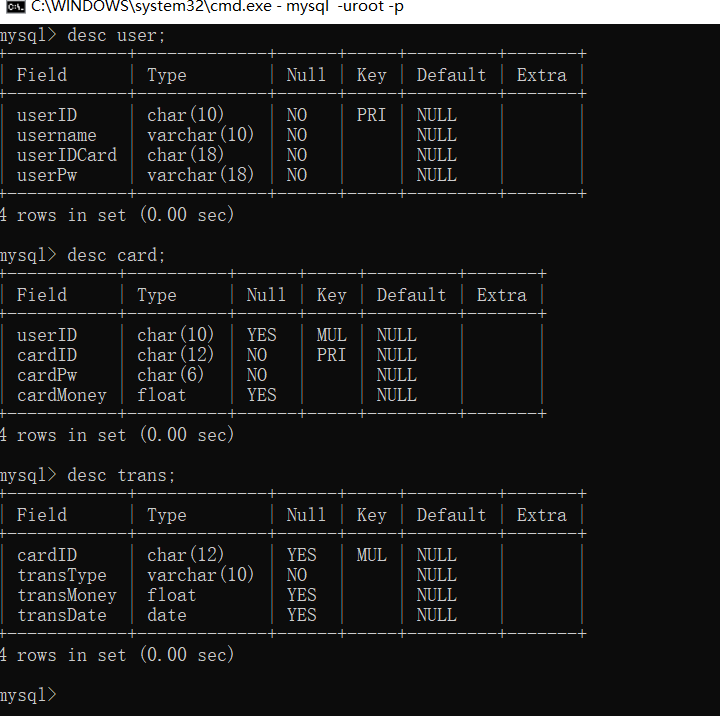
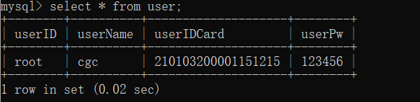
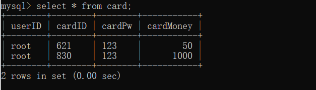
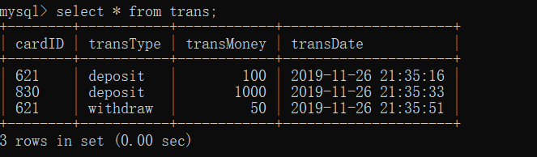

# database-project-term
数据库大作业（银行系统，本地版和联网版）

数据库结构如下

----
### desc:

### user表：

### card表:

### tran表：

几个数据库都是java写的，区别在于

# jdbd_atm副本
 这个原生的，没有任何框架（除了mysql驱动），是在本地上运行，没有javaWeb.
# springFestival
 这个只是加上了前端，servlet，没有ssh框架
# SSMBank
 加上了ssm框架。

__后面两个的数据库结构可能变化了，具体进入src->dao里面查看各个sql语句__
